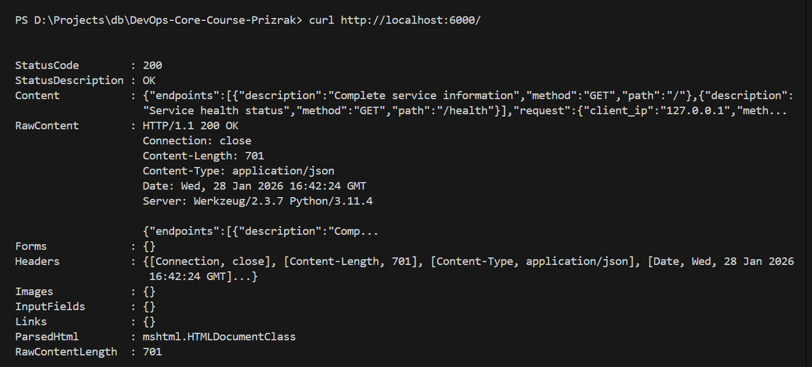
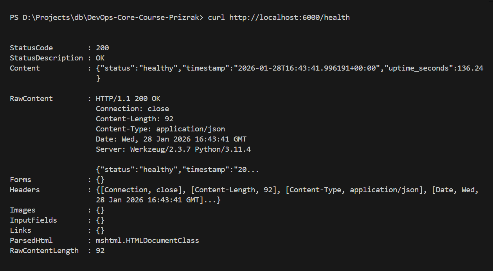
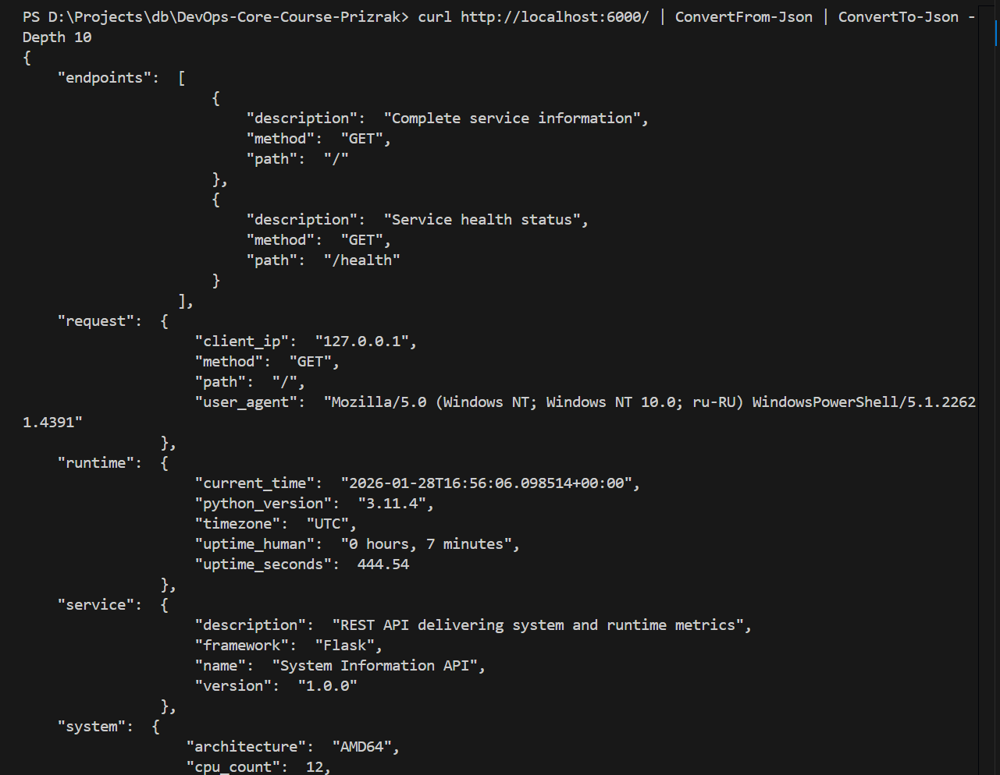

# Lab 01 - System Information API Service

## Framework Selection

### Chosen Framework: Flask

Selected **Flask 3.0.0** as the web framework for this project based on the following considerations:

#### Comparison Table

| Feature | Flask | FastAPI | Django |
|---------|-------|---------|--------|
| Learning Curve | Easy | Moderate | Steep |
| Performance | Good | Excellent | Good |
| Async Support | Limited | Native | Partial |
| Documentation | Extensive | Modern | Comprehensive |
| Community | Large | Growing | Very Large |
| Use Case | Simple APIs | Modern APIs | Full Web Apps |
| Built-in Features | Minimal | API-focused | Everything included |

#### Justification

Flask was chosen for the following reasons:

1. **Simplicity and Clarity**: Flask's minimalist design makes it perfect for learning core web development concepts without the overhead of unnecessary features.

2. **Proven Track Record**: With years of production use, Flask has a stable ecosystem and extensive community support, making troubleshooting straightforward.

3. **Flexibility**: Flask doesn't impose architectural decisions, allowing me to structure the application as needed while keeping it lightweight.

4. **Perfect Fit for Requirements**: For this project's scope (basic REST endpoints with JSON responses), Flask provides exactly what's needed without additional complexity.

5. **Industry Relevance**: Flask remains widely used in production environments, making this experience directly applicable to real-world scenarios.

While FastAPI offers better performance and automatic documentation, Flask's simplicity and maturity make it the ideal choice for building a solid foundation in web service development.

---

## Best Practices Applied

### 1. Clean Code Organization

**Implementation:**
```python
"""System Information API - Flask-based web service for Lab 01."""

import time
import logging
import os
import platform
import socket
from datetime import datetime, timezone

from flask import Flask, jsonify, request
```

**Importance:** Proper code organization with clear imports, docstrings, and logical structure makes the codebase maintainable and easier for others to understand.

### 2. Configuration via Environment Variables

**Implementation:**
```python
BIND_HOST = os.environ.get("HOST", "0.0.0.0")
BIND_PORT = int(os.environ.get("PORT", 6000))
DEBUG_MODE = os.environ.get("DEBUG", "false").lower() == "true"
```

**Importance:** Environment-based configuration follows the [12-Factor App](https://12factor.net/) methodology, enabling deployment flexibility across different environments without code changes.

### 3. Comprehensive Logging

**Implementation:**
```python
logging.basicConfig(
    level=logging.DEBUG if DEBUG_MODE else logging.INFO,
    format="%(asctime)s [%(levelname)s] %(name)s: %(message)s",
)
log = logging.getLogger(__name__)

log.info("Root endpoint accessed from %s", request.remote_addr)
```

**Importance:** Proper logging is essential for debugging, monitoring, and understanding application behavior in production environments.

### 4. Error Handling

**Implementation:**
```python
@app.errorhandler(404)
def handle_not_found(error):
    """Process 404 Not Found errors."""
    log.warning("Resource not found: %s %s", request.method, request.path)
    return jsonify({"error": "Not Found", "path": request.path}), 404

@app.errorhandler(500)
def handle_server_error(error):
    """Process 500 Internal Server errors."""
    log.error("Internal server error occurred: %s", error)
    return jsonify({"error": "Internal Server Error"}), 500
```

**Importance:** Graceful error handling improves user experience and helps identify issues quickly through structured error responses.

### 5. Dependency Management

**Implementation:**
```txt
Flask==3.0.0
```

**Importance:** Pinning exact versions in `requirements.txt` ensures reproducible builds and prevents unexpected breaking changes from dependency updates.

---

## API Documentation

### Endpoint: `GET /`

Returns comprehensive service information including system metrics, runtime details, and request metadata.

**Request:**
```bash
curl http://localhost:6000/
```

**Response:**
```json
{
  "service": {
    "name": "System Information API",
    "version": "1.0.0",
    "description": "REST API delivering system and runtime metrics"
  },
  "system": {
    "hostname": "my-laptop",
    "platform": "Linux",
    "platform_version": "6.8.0-49-generic",
    "architecture": "x86_64",
    "cpu_count": 8
  },
  "runtime": {
    "python_version": "3.11.0",
    "uptime_seconds": 127.45,
    "current_time": "2026-01-28T12:30:00.000000+00:00",
    "timezone": "UTC"
  },
  "request": {
    "client_ip": "127.0.0.1",
    "user_agent": "curl/8.5.0",
    "method": "GET",
    "path": "/"
  },
  "endpoints": [
    {
      "path": "/",
      "method": "GET",
      "description": "Complete service information"
    },
    {
      "path": "/health",
      "method": "GET",
      "description": "Service health status"
    }
  ]
}
```

### Endpoint: `GET /health`

Provides a lightweight health check endpoint for monitoring and orchestration tools.

**Request:**
```bash
curl http://localhost:6000/health
```

**Response:**
```json
{
  "status": "healthy",
  "timestamp": "2026-01-28T12:30:00.000000+00:00",
  "uptime_seconds": 127.45
}
```

**Status Code:** 200 OK

---

## Testing Evidence

### Screenshot 1: Main Endpoint


The main endpoint returns all required fields including service metadata, system information, runtime details, and request information.

### Screenshot 2: Health Check


The health endpoint provides status and uptime information for monitoring purposes.

### Screenshot 3: Formatted Output


Using `jq` or similar tools to display pretty-printed JSON output for better readability.

### Testing Commands

```bash
# Test main endpoint
curl http://localhost:6000/ | jq

# Test health check
curl http://localhost:6000/health | jq

# Test with custom configuration
PORT=8080 python app.py

# Test environment variables
HOST=127.0.0.1 PORT=3000 DEBUG=true python app.py
```

---

## Challenges & Solutions

### Challenge 1: Uptime Calculation Accuracy

**Problem:** Initially struggled with calculating accurate uptime that persists across different request handlers.

**Solution:** Defined `STARTUP_TIMESTAMP` as a module-level variable at application initialization, ensuring consistent uptime calculation across all endpoints:

```python
STARTUP_TIMESTAMP = time.time()

# Later in endpoint handlers
elapsed_time = time.time() - STARTUP_TIMESTAMP
```

### Challenge 2: Timezone Handling

**Problem:** Python's datetime handling can be confusing with naive vs aware datetime objects.

**Solution:** Explicitly used timezone-aware datetime objects with UTC timezone to ensure consistency:

```python
from datetime import datetime, timezone

timestamp_now = datetime.now(timezone.utc).isoformat()
```

### Challenge 3: JSON Response Formatting

**Problem:** Ensuring consistent JSON formatting and structure across all endpoints.

**Solution:** Used Flask's `jsonify()` function which automatically sets correct content-type headers and handles JSON serialization properly:

```python
return jsonify(data)  # Automatically sets Content-Type: application/json
```

---

## GitHub Community

### Why Starring Repositories Matters

Starring repositories serves multiple important purposes in the open-source ecosystem. It acts as a bookmarking system for developers to save interesting projects for future reference, while simultaneously signaling quality and trust to the broader community. High star counts help projects gain visibility, attract contributors, and validate the work of maintainers who dedicate their time to open source.

### How Following Developers Helps

Following developers on GitHub creates professional networking opportunities and facilitates continuous learning. By observing what experienced developers work on, we can discover new projects, learn best practices from their commits, and stay informed about emerging technologies and trends. In team projects, following classmates and colleagues makes collaboration smoother by keeping everyone updated on each other's work and fostering a supportive learning community.

### Actions Completed

- ✅ Starred the course repository
- ✅ Starred [simple-container-com/api](https://github.com/simple-container-com/api)
- ✅ Followed [@Cre-eD](https://github.com/Cre-eD) (Professor)
- ✅ Followed [@marat-biriushev](https://github.com/marat-biriushev) (TA)
- ✅ Followed [@pierrepicaud](https://github.com/pierrepicaud) (TA)
- ✅ Followed 3+ classmates from the course

---

## Conclusion

This lab provided valuable hands-on experience with web service development fundamentals. By implementing a system information API with Flask, I gained practical knowledge of REST API design, system introspection, configuration management, and Python best practices. The application is now ready to evolve throughout the course as we add containerization, CI/CD pipelines, monitoring, and persistence layers in subsequent labs.