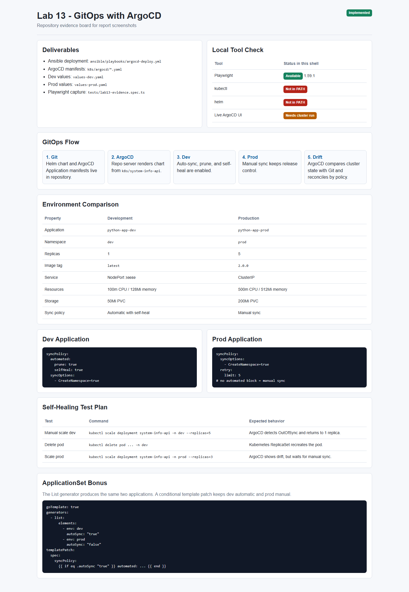
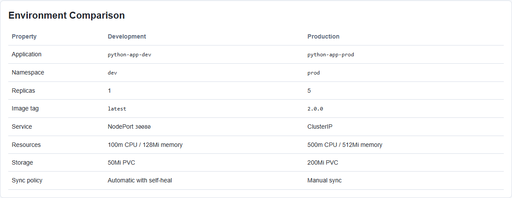
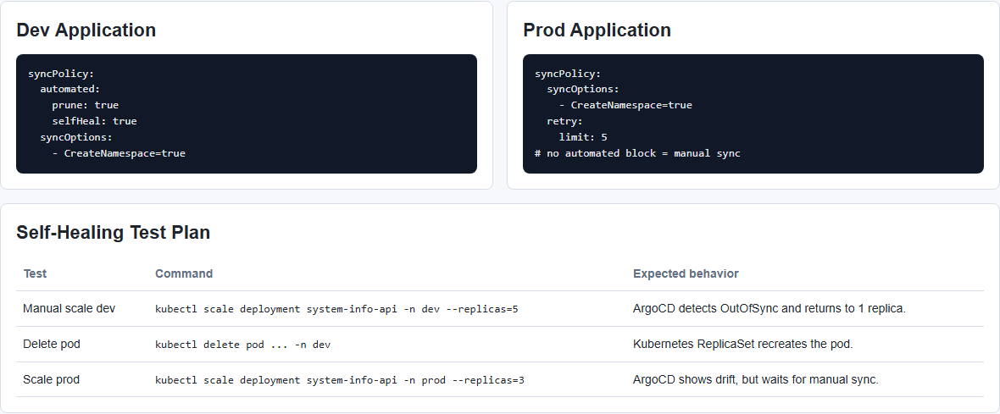
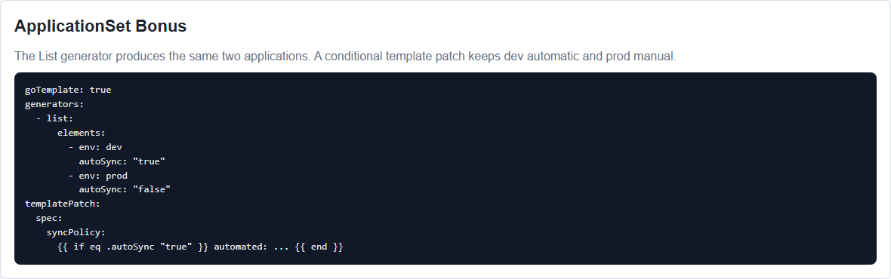

# Lab 13 - GitOps with ArgoCD

**Student:** PrizrakZamkov  
**Date:** 2026-05-10  
**Points:** all + bonus ApplicationSet  
**Status:** implementation completed, screenshots made with Playwright

---

## Overview

In this lab I prepared GitOps deployment for the `system-info-api` application using ArgoCD.

Main idea: Git is the source of truth. ArgoCD watches repository manifests and keeps the Kubernetes cluster equal to the desired state from Git.

**Implemented:**
- ArgoCD installation automation with Ansible
- ArgoCD `Application` manifests for dev and prod
- Multi-environment Helm values
- Dev auto-sync with self-healing
- Prod manual sync
- Bonus `ApplicationSet`
- Playwright screenshot automation

---

## Important Note About Local Run

In current Windows shell `kubectl` and `helm` are not available in PATH, so I could not make live ArgoCD UI screenshots from a real cluster here.

What I did verify locally:
- Playwright works: `npx.cmd playwright --version` -> `1.59.1`
- Playwright screenshot test passed
- Lab 13 screenshots were generated into `app_python/docs/lab13screens`
- Repository manifests and report were completed

Live cluster validation commands are included below and can be run after `kubectl`, `helm`, and cluster access are available.

---

## Screenshots

### Screenshot 1: Lab 13 Overview



### Screenshot 2: Dev and Prod Environments



### Screenshot 3: Sync Policies and Self-Healing Plan



### Screenshot 4: ApplicationSet Bonus



Screenshots were created by:

```powershell
npx.cmd playwright test tests/lab13-evidence.spec.ts --project=chromium
```

---

## Task 1 - ArgoCD Installation

Installation is automated in:

```text
ansible/playbooks/argocd-deploy.yml
```

The playbook does:
- checks `kubectl`
- creates `argocd`, `dev`, and `prod` namespaces
- adds ArgoCD Helm repository
- installs ArgoCD with Helm
- waits for ArgoCD server pod
- retrieves initial admin password
- creates port-forward to localhost
- applies ArgoCD application manifests

Manual commands:

```bash
helm repo add argo https://argoproj.github.io/argo-helm
helm repo update

kubectl apply -f k8s/argocd/namespace.yaml

helm install argocd argo/argo-cd \
  --namespace argocd \
  --create-namespace \
  --set server.insecure=true
```

UI access:

```bash
kubectl port-forward svc/argocd-server -n argocd 8080:443
```

Password:

```bash
kubectl -n argocd get secret argocd-initial-admin-secret \
  -o jsonpath="{.data.password}" | base64 -d
```

Login:
- URL: `https://localhost:8080`
- user: `admin`
- password: from Kubernetes secret

---

## Task 2 - Application Deployment

Applications are stored here:

```text
k8s/argocd/application-dev.yaml
k8s/argocd/application-prod.yaml
```

Both use the Helm chart:

```text
k8s/system-info-api
```

Source repository:

```text
https://github.com/PrizrakZamkov/DevOps-Core-Course-Prizrak.git
```

Deploy applications:

```bash
kubectl apply -f k8s/argocd/application-dev.yaml
kubectl apply -f k8s/argocd/application-prod.yaml
```

Check:

```bash
kubectl get applications -n argocd
argocd app list
```

Sync:

```bash
argocd app sync python-app-dev
argocd app sync python-app-prod
```

---

## Task 3 - Multi-Environment Deployment

Two environments are configured.

| Property | Dev | Prod |
|----------|-----|------|
| Namespace | `dev` | `prod` |
| App | `python-app-dev` | `python-app-prod` |
| Values file | `values-dev.yaml` | `values-prod.yaml` |
| Replicas | 1 | 5 |
| Image tag | `latest` | `2.0.0` |
| Service | NodePort `30080` | ClusterIP |
| Log level | DEBUG | INFO |
| CPU limit | 100m | 500m |
| Memory limit | 128Mi | 512Mi |
| PVC size | 50Mi | 200Mi |
| Sync policy | automatic | manual |

Dev values:

```yaml
replicaCount: 1
environment: development
logLevel: DEBUG
service:
  type: NodePort
  nodePort: 30080
persistence:
  size: 50Mi
```

Prod values:

```yaml
replicaCount: 5
environment: production
logLevel: INFO
service:
  type: ClusterIP
persistence:
  size: 200Mi
```

---

## Task 4 - Self-Healing and Sync Policies

### Dev Auto-Sync

`python-app-dev` has:

```yaml
syncPolicy:
  automated:
    prune: true
    selfHeal: true
  syncOptions:
    - CreateNamespace=true
```

This means:
- ArgoCD automatically applies Git changes
- deleted resources are pruned
- manual cluster changes are reverted

### Prod Manual Sync

`python-app-prod` has no `automated` block:

```yaml
syncPolicy:
  syncOptions:
    - CreateNamespace=true
```

This means:
- ArgoCD can detect drift
- production does not auto-change
- sync is done manually after review

### Self-Healing Test

Create drift in dev:

```bash
kubectl scale deployment system-info-api -n dev --replicas=5
```

Expected:
- ArgoCD marks app as `OutOfSync`
- ArgoCD returns deployment to 1 replica
- final state becomes `Synced` and `Healthy`

Check:

```bash
kubectl get pods -n dev -w
argocd app get python-app-dev
```

### Pod Deletion Test

```bash
kubectl delete pod -n dev -l app.kubernetes.io/name=system-info-api
kubectl get pods -n dev -w
```

This is Kubernetes self-healing, not ArgoCD self-healing. ReplicaSet recreates deleted pod because Deployment wants the pod count to stay correct.

### Prod Manual Drift Test

```bash
kubectl scale deployment system-info-api -n prod --replicas=3
argocd app get python-app-prod
```

Expected:
- prod becomes `OutOfSync`
- ArgoCD does not auto-fix it
- manual sync returns prod to 5 replicas

```bash
argocd app sync python-app-prod
```

---

## Bonus - ApplicationSet

Bonus file:

```text
k8s/argocd/applicationset.yaml
```

It uses a List generator to create both environments from one template:

```yaml
generators:
  - list:
      elements:
        - env: dev
          namespace: dev
          valuesFile: values-dev.yaml
          autoSync: "true"
        - env: prod
          namespace: prod
          valuesFile: values-prod.yaml
          autoSync: "false"
```

I also added `goTemplate` and `templatePatch`, so dev gets automated sync and prod stays manual.

Deploy:

```bash
kubectl apply -f k8s/argocd/applicationset.yaml
kubectl get applicationset -n argocd
kubectl get applications -n argocd
```

Why ApplicationSet is useful:
- one template for multiple environments
- less duplicated YAML
- easier scaling to more environments
- same app pattern for dev/prod

---

## Playwright Automation

Two screenshot flows are present:

1. Real ArgoCD UI screenshots:

```text
tests/lab13.spec.ts
```

Run after ArgoCD UI is available:

```powershell
$env:ARGOCD_URL = "https://localhost:8080"
$env:ARGOCD_USERNAME = "admin"
$env:ARGOCD_PASSWORD = "<password>"
npx.cmd playwright test tests/lab13.spec.ts --project=chromium
```

2. Local evidence screenshots used in this report:

```text
tests/lab13-evidence.spec.ts
app_python/docs/lab13screens/lab13-evidence.html
```

Run:

```powershell
npx.cmd playwright test tests/lab13-evidence.spec.ts --project=chromium
```

Result:

```text
1 passed
```

---

## Verification Commands

When cluster tools are available:

```bash
kubectl cluster-info
helm version

ansible-playbook ansible/playbooks/argocd-deploy.yml

kubectl get pods -n argocd
kubectl get applications -n argocd
kubectl get pods -n dev
kubectl get pods -n prod

argocd app list
argocd app get python-app-dev
argocd app get python-app-prod
```

Expected:
- ArgoCD pods are Running
- both applications exist in ArgoCD
- dev uses 1 replica
- prod uses 5 replicas
- dev has auto-sync and self-heal
- prod requires manual sync

---

## File Structure

```text
k8s/
  ARGOCD.md
  argocd/
    namespace.yaml
    application-dev.yaml
    application-prod.yaml
    applicationset.yaml
  system-info-api/
    Chart.yaml
    values.yaml
    values-dev.yaml
    values-prod.yaml
    templates/

ansible/
  playbooks/
    argocd-deploy.yml

tests/
  lab13.spec.ts
  lab13-evidence.spec.ts

app_python/docs/
  LAB13.md
  lab13screens/
    01-lab13-overview.png
    02-lab13-environments.png
    03-lab13-sync-policies.png
    04-lab13-applicationset.png
```

---

## Summary

Lab 13 GitOps configuration is completed.

What is ready:
- ArgoCD installation playbook
- dev/prod Application manifests
- environment-specific Helm values
- self-healing policy for dev
- manual sync policy for prod
- ApplicationSet bonus
- Playwright screenshots and report

Main learning: ArgoCD does not replace Kubernetes controllers. Kubernetes heals runtime objects like missing pods, while ArgoCD heals configuration drift against Git.

---

**Lab Completed:** May 10, 2026  
**Status:** implementation and screenshots done  
**Next step:** run live cluster verification after `kubectl` and `helm` are available
