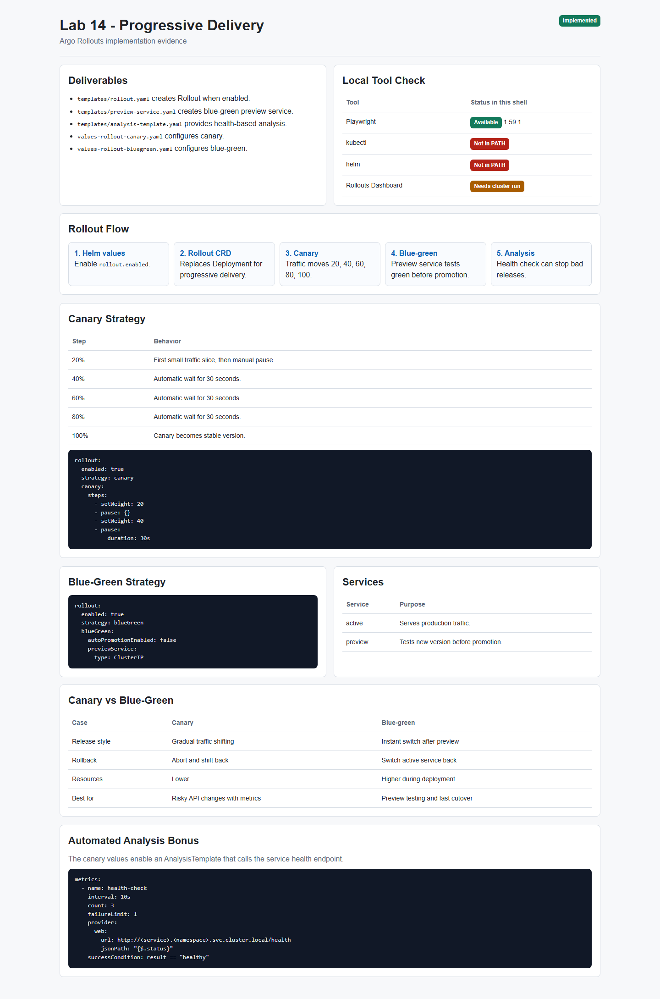
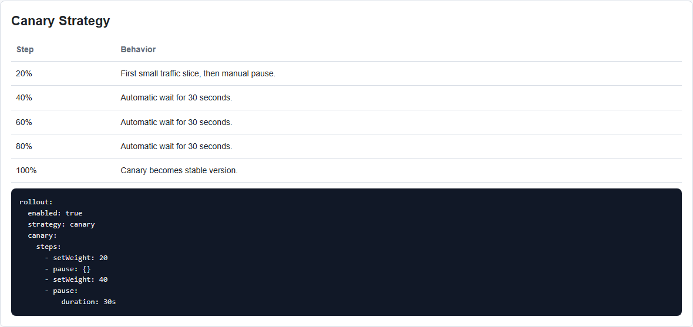
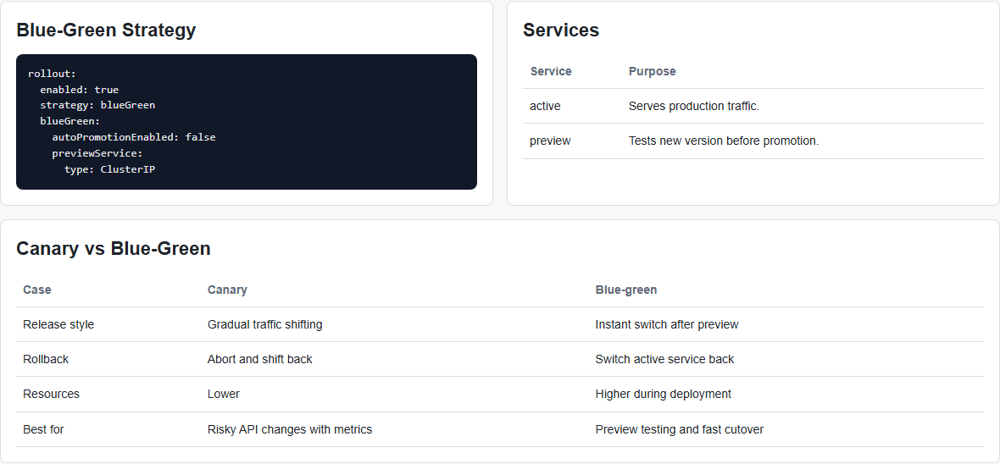
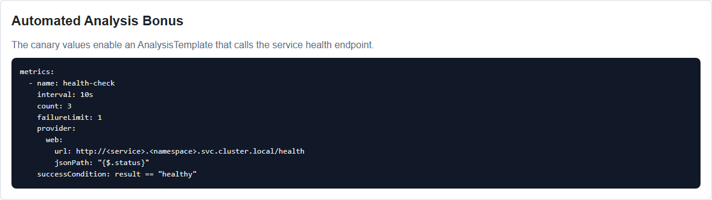

# Lab 14 - Progressive Delivery with Argo Rollouts

**Student:** PrizrakZamkov  
**Date:** 2026-05-10  
**Points:** all + bonus analysis  
**Status:** implementation completed, screenshots made with Playwright

---

## Overview

In this lab I prepared progressive delivery for `system-info-api` using Argo Rollouts.

Argo Rollouts extends Kubernetes Deployment behavior. Instead of only normal rolling updates, it can use canary and blue-green strategies, manual promotion, abort, rollback, and automated analysis.

**Implemented:**
- optional Helm Rollout template
- canary deployment values
- blue-green deployment values
- preview service for blue-green
- AnalysisTemplate bonus
- ArgoCD Application manifests for canary and blue-green
- `k8s/ROLLOUTS.md` documentation
- Playwright screenshot automation

---

## Important Note About Local Run

In current Windows shell `kubectl` and `helm` are not available in PATH, so I could not make live Argo Rollouts Dashboard screenshots from a real cluster here.

What I did verify locally:
- Playwright works
- Playwright screenshot test passed
- Lab 14 screenshots were generated into `app_python/docs/lab14screens`
- all Lab 14 manifests and documentation were created

Live cluster validation commands are included below.

---

## Screenshots

### Screenshot 1: Lab 14 Overview



### Screenshot 2: Canary Strategy



### Screenshot 3: Blue-Green Strategy



### Screenshot 4: Automated Analysis



Screenshots were created by:

```powershell
npx.cmd playwright test tests/lab14-evidence.spec.ts --project=chromium
```

---

## Task 1 - Argo Rollouts Fundamentals

Install Argo Rollouts controller:

```bash
kubectl create namespace argo-rollouts
kubectl apply -n argo-rollouts -f https://github.com/argoproj/argo-rollouts/releases/latest/download/install.yaml
```

Install dashboard:

```bash
kubectl apply -n argo-rollouts -f https://github.com/argoproj/argo-rollouts/releases/latest/download/dashboard-install.yaml
kubectl port-forward svc/argo-rollouts-dashboard -n argo-rollouts 3100:3100
```

Open:

```text
http://localhost:3100
```

Verify:

```bash
kubectl get pods -n argo-rollouts
kubectl argo rollouts version
```

### Rollout vs Deployment

| Deployment | Rollout |
|------------|---------|
| regular rolling update | canary and blue-green |
| Kubernetes controls update | Argo Rollouts controls update |
| no manual promotion | manual/automatic promotion |
| basic rollback | abort, retry, promote, undo |
| no metric gate | AnalysisTemplate can stop bad release |

---

## Task 2 - Canary Deployment

Canary values file:

```text
k8s/system-info-api/values-rollout-canary.yaml
```

Canary strategy:

```yaml
rollout:
  enabled: true
  strategy: canary
  canary:
    steps:
      - setWeight: 20
      - pause: {}
      - setWeight: 40
      - pause:
          duration: 30s
      - setWeight: 60
      - pause:
          duration: 30s
      - setWeight: 80
      - pause:
          duration: 30s
      - setWeight: 100
```

Deploy:

```bash
helm upgrade --install system-info-canary k8s/system-info-api \
  -n rollout-canary --create-namespace \
  -f k8s/system-info-api/values-rollout-canary.yaml
```

Watch rollout:

```bash
kubectl argo rollouts get rollout system-info-canary-system-info-api -n rollout-canary -w
```

Promote after first manual pause:

```bash
kubectl argo rollouts promote system-info-canary-system-info-api -n rollout-canary
```

Abort rollback test:

```bash
kubectl argo rollouts abort system-info-canary-system-info-api -n rollout-canary
```

Expected behavior:
- 20% traffic goes to new version
- rollout waits for manual promote
- then goes 40%, 60%, 80%, 100%
- abort returns traffic back to stable version

---

## Task 3 - Blue-Green Deployment

Blue-green values file:

```text
k8s/system-info-api/values-rollout-bluegreen.yaml
```

Blue-green strategy:

```yaml
rollout:
  enabled: true
  strategy: blueGreen
  blueGreen:
    autoPromotionEnabled: false
    scaleDownDelaySeconds: 30
    previewService:
      type: ClusterIP
```

Deploy:

```bash
helm upgrade --install system-info-bluegreen k8s/system-info-api \
  -n rollout-bluegreen --create-namespace \
  -f k8s/system-info-api/values-rollout-bluegreen.yaml
```

Active service:

```bash
kubectl port-forward svc/system-info-bluegreen-system-info-api -n rollout-bluegreen 8080:80
```

Preview service:

```bash
kubectl port-forward svc/system-info-bluegreen-system-info-api-preview -n rollout-bluegreen 8081:80
```

Promote green version:

```bash
kubectl argo rollouts promote system-info-bluegreen-system-info-api -n rollout-bluegreen
```

Expected behavior:
- active service keeps stable traffic
- preview service exposes new version
- after testing, promotion switches active traffic instantly
- rollback is fast because service selector switches back

---

## Helm Chart Changes

Normal Deployment is still used by default:

```yaml
rollout:
  enabled: false
```

When Rollout is enabled, Deployment is disabled and this template is rendered:

```text
k8s/system-info-api/templates/rollout.yaml
```

Blue-green preview service:

```text
k8s/system-info-api/templates/preview-service.yaml
```

Bonus analysis template:

```text
k8s/system-info-api/templates/analysis-template.yaml
```

This keeps old labs working and enables Lab 14 only through values files.

---

## Bonus - Automated Analysis

Analysis is enabled in canary values:

```yaml
rollout:
  analysis:
    enabled: true
    interval: 10s
    count: 3
    failureLimit: 1
    healthPath: /health
    expectedStatus: healthy
```

AnalysisTemplate checks:

```text
http://<service>.<namespace>.svc.cluster.local/health
```

Expected result:

```json
{"status":"healthy"}
```

If health check fails, analysis fails and rollout can be stopped before the bad version reaches 100%.

---

## GitOps Integration

I also added ArgoCD Application manifests for Lab 14:

```text
k8s/argocd/application-rollout-canary.yaml
k8s/argocd/application-rollout-bluegreen.yaml
```

Deploy with ArgoCD:

```bash
kubectl apply -f k8s/argocd/application-rollout-canary.yaml
kubectl apply -f k8s/argocd/application-rollout-bluegreen.yaml
```

These applications use:

```text
values-rollout-canary.yaml
values-rollout-bluegreen.yaml
```

So Lab 14 can be deployed through the GitOps workflow from Lab 13.

---

## Strategy Comparison

| Case | Canary | Blue-green |
|------|--------|------------|
| Release style | gradual traffic shift | instant switch after preview |
| Risk control | exposes small percent first | tests full new version before promotion |
| Rollback | abort and shift back | switch service back |
| Resource usage | lower | higher during rollout |
| Best for | APIs, risky changes, metric checks | releases that need preview testing |

My conclusion:
- canary is better when I want to test new version on small real traffic first
- blue-green is better when I want to test preview version and switch all traffic at once

---

## Playwright Automation

Evidence page:

```text
app_python/docs/lab14screens/lab14-evidence.html
```

Screenshot test:

```text
tests/lab14-evidence.spec.ts
```

Run:

```powershell
npx.cmd playwright test tests/lab14-evidence.spec.ts --project=chromium
```

Result:

```text
1 passed
```

---

## Verification Commands

When `kubectl` and `helm` are available:

```bash
kubectl get pods -n argo-rollouts

helm template system-info-canary k8s/system-info-api \
  -f k8s/system-info-api/values-rollout-canary.yaml

helm template system-info-bluegreen k8s/system-info-api \
  -f k8s/system-info-api/values-rollout-bluegreen.yaml

kubectl get rollouts -A
kubectl argo rollouts list rollouts -A
```

Expected:
- Argo Rollouts controller is Running
- canary Rollout is created
- blue-green Rollout is created
- preview service exists for blue-green
- AnalysisTemplate exists for canary

---

## File Structure

```text
k8s/
  ROLLOUTS.md
  argocd/
    application-rollout-canary.yaml
    application-rollout-bluegreen.yaml
  system-info-api/
    values-rollout-canary.yaml
    values-rollout-bluegreen.yaml
    templates/
      rollout.yaml
      preview-service.yaml
      analysis-template.yaml

tests/
  lab14-evidence.spec.ts

app_python/docs/
  LAB14.md
  lab14screens/
    01-lab14-overview.png
    02-lab14-canary.png
    03-lab14-bluegreen.png
    04-lab14-analysis.png
```

---

## Summary

Lab 14 progressive delivery configuration is completed.

What is ready:
- Argo Rollouts setup documentation
- Rollout Helm template
- canary strategy with manual first promotion
- blue-green strategy with preview service
- automated health analysis bonus
- ArgoCD GitOps integration
- Playwright screenshots and report

Main learning: Rollouts are useful when normal Deployments are not safe enough. Canary reduces risk gradually, and blue-green gives fast preview and instant switch.

---

**Lab Completed:** May 10, 2026  
**Status:** implementation and screenshots done  
**Next step:** run live cluster verification after `kubectl` and `helm` are available
