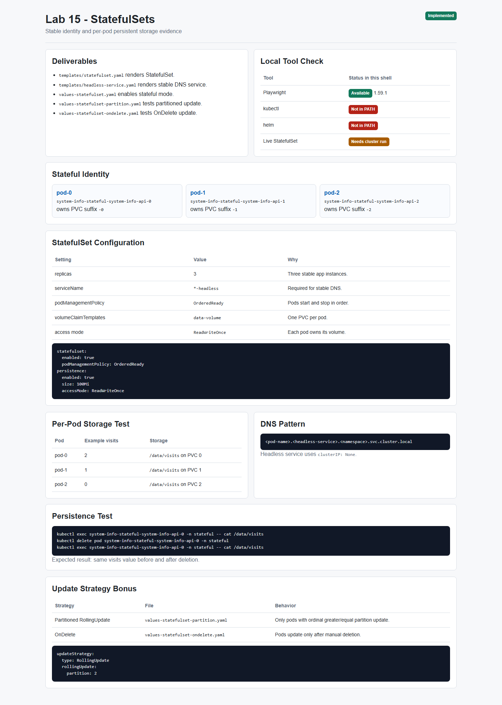
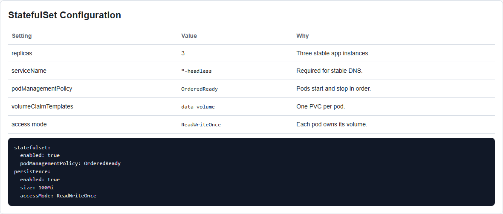
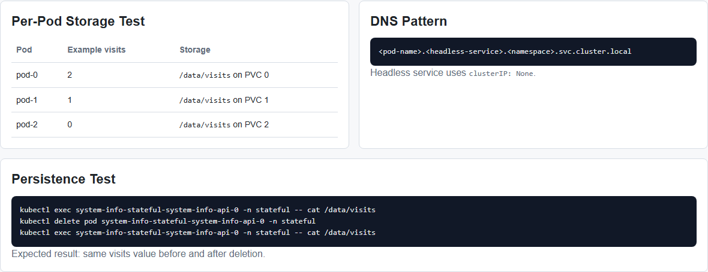
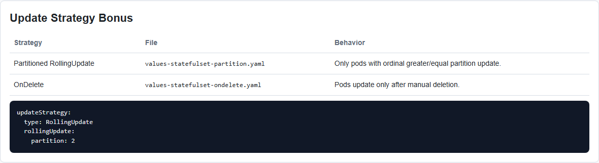

# Lab 15 - StatefulSets & Persistent Storage

**Student:** PrizrakZamkov  
**Date:** 2026-05-10  
**Points:** all + bonus update strategies  
**Status:** implementation completed, screenshots made with Playwright

---

## Overview

In this lab I prepared StatefulSet deployment for `system-info-api`.

StatefulSet is useful when every pod needs stable name, stable DNS, and its own persistent storage. This is different from Rollouts from Lab 14: Rollouts are for progressive delivery, StatefulSets are for stateful applications.

**Implemented:**
- optional Helm StatefulSet template
- headless service for stable pod DNS
- per-pod PVCs with `volumeClaimTemplates`
- StatefulSet values file
- ArgoCD Application manifest for GitOps deployment
- bonus update strategies: partitioned RollingUpdate and OnDelete
- `k8s/STATEFULSET.md` documentation
- Playwright screenshot automation

---

## Important Note About Local Run

In current Windows shell `kubectl` and `helm` are not available in PATH, so I could not make live Kubernetes screenshots from a real StatefulSet here.

What I did verify locally:
- Playwright works
- Playwright screenshot test passed
- Lab 15 screenshots were generated into `app_python/docs/lab15screens`
- all Lab 15 manifests and documentation were created

Live cluster validation commands are included below.

---

## Screenshots

### Screenshot 1: Lab 15 Overview



### Screenshot 2: StatefulSet Configuration



### Screenshot 3: Storage and DNS Tests



### Screenshot 4: Update Strategy Bonus



Screenshots were created by:

```powershell
npx.cmd playwright test tests/lab15-evidence.spec.ts --project=chromium
```

---

## Task 1 - StatefulSet Concepts

StatefulSet guarantees:
- stable pod names
- stable network identity
- stable per-pod persistent storage
- ordered deployment and scaling

### Deployment vs StatefulSet

| Feature | Deployment | StatefulSet |
|---------|------------|-------------|
| Pod names | random suffix | ordered suffix `-0`, `-1`, `-2` |
| Storage | shared PVC or manual PVC | per-pod PVC from template |
| Scaling | any order | ordered by default |
| Network ID | service load balancing | stable DNS per pod |
| Best for | stateless apps | databases, queues, stateful apps |

### Headless Service

Headless service uses:

```yaml
clusterIP: None
```

DNS pattern:

```text
<pod-name>.<headless-service>.<namespace>.svc.cluster.local
```

Example:

```text
system-info-stateful-system-info-api-0.system-info-stateful-system-info-api-headless.stateful.svc.cluster.local
```

---

## Task 2 - Convert Deployment to StatefulSet

StatefulSet template:

```text
k8s/system-info-api/templates/statefulset.yaml
```

Headless service:

```text
k8s/system-info-api/templates/headless-service.yaml
```

Values file:

```text
k8s/system-info-api/values-statefulset.yaml
```

Important configuration:

```yaml
statefulset:
  enabled: true
  podManagementPolicy: OrderedReady

persistence:
  enabled: true
  size: 100Mi
  accessMode: ReadWriteOnce
```

Deploy:

```bash
helm upgrade --install system-info-stateful k8s/system-info-api \
  -n stateful --create-namespace \
  -f k8s/system-info-api/values-statefulset.yaml
```

Expected pods:

```text
system-info-stateful-system-info-api-0
system-info-stateful-system-info-api-1
system-info-stateful-system-info-api-2
```

Expected PVCs:

```text
data-volume-system-info-stateful-system-info-api-0
data-volume-system-info-stateful-system-info-api-1
data-volume-system-info-stateful-system-info-api-2
```

---

## Task 3 - Headless Service and Pod Identity

DNS test:

```bash
kubectl exec -it system-info-stateful-system-info-api-0 -n stateful -- /bin/sh
nslookup system-info-stateful-system-info-api-1.system-info-stateful-system-info-api-headless.stateful.svc.cluster.local
```

Expected:

```text
Name: system-info-stateful-system-info-api-1.system-info-stateful-system-info-api-headless.stateful.svc.cluster.local
Address: <pod-ip>
```

Per-pod storage test:

```bash
kubectl port-forward pod/system-info-stateful-system-info-api-0 -n stateful 8080:6000
kubectl port-forward pod/system-info-stateful-system-info-api-1 -n stateful 8081:6000
kubectl port-forward pod/system-info-stateful-system-info-api-2 -n stateful 8082:6000
```

Call pods:

```bash
curl http://localhost:8080/
curl http://localhost:8080/
curl http://localhost:8081/
```

Check visits:

```bash
curl http://localhost:8080/visits
curl http://localhost:8081/visits
curl http://localhost:8082/visits
```

Expected:

```text
pod-0: {"visits":2}
pod-1: {"visits":1}
pod-2: {"visits":0}
```

This proves each pod owns a separate `/data/visits` file.

### Persistence Test

```bash
kubectl exec system-info-stateful-system-info-api-0 -n stateful -- cat /data/visits
kubectl delete pod system-info-stateful-system-info-api-0 -n stateful
kubectl get pods -n stateful -w
kubectl exec system-info-stateful-system-info-api-0 -n stateful -- cat /data/visits
```

Expected:
- pod is recreated with same name
- same PVC is mounted
- visits count stays the same

---

## Task 4 - Documentation

Created:

```text
k8s/STATEFULSET.md
```

It includes:
- StatefulSet overview
- Deployment vs StatefulSet comparison
- headless service DNS pattern
- resource verification commands
- per-pod storage test
- persistence test
- bonus update strategy notes

---

## Bonus - Update Strategies

### Partitioned RollingUpdate

File:

```text
k8s/system-info-api/values-statefulset-partition.yaml
```

Configuration:

```yaml
statefulset:
  updateStrategy:
    type: RollingUpdate
    partitioned: true
    partition: 2
```

With 3 replicas, only pod with ordinal `>= 2` updates. So pod `-2` updates, while `-0` and `-1` stay on the old version.

### OnDelete

File:

```text
k8s/system-info-api/values-statefulset-ondelete.yaml
```

Configuration:

```yaml
statefulset:
  updateStrategy:
    type: OnDelete
```

Pods do not update automatically. They update only after manual deletion. This is useful when every stateful instance needs careful manual maintenance.

---

## GitOps Integration

ArgoCD Application manifest:

```text
k8s/argocd/application-statefulset.yaml
```

Deploy with ArgoCD:

```bash
kubectl apply -f k8s/argocd/application-statefulset.yaml
```

It uses:

```text
k8s/system-info-api/values-statefulset.yaml
```

So Lab 15 can be deployed through GitOps like Labs 13 and 14.

---

## Playwright Automation

Evidence page:

```text
app_python/docs/lab15screens/lab15-evidence.html
```

Screenshot test:

```text
tests/lab15-evidence.spec.ts
```

Run:

```powershell
npx.cmd playwright test tests/lab15-evidence.spec.ts --project=chromium
```

Result:

```text
1 passed
```

---

## Verification Commands

When `kubectl` and `helm` are available:

```bash
helm template system-info-stateful k8s/system-info-api \
  -f k8s/system-info-api/values-statefulset.yaml

helm upgrade --install system-info-stateful k8s/system-info-api \
  -n stateful --create-namespace \
  -f k8s/system-info-api/values-statefulset.yaml

kubectl get po,sts,svc,pvc -n stateful
kubectl describe statefulset system-info-stateful-system-info-api -n stateful
kubectl get pods -n stateful -o wide
```

Expected:
- StatefulSet exists
- pods are named `-0`, `-1`, `-2`
- headless service exists
- each pod has its own PVC
- visits count survives pod deletion

---

## File Structure

```text
k8s/
  STATEFULSET.md
  argocd/
    application-statefulset.yaml
  system-info-api/
    values-statefulset.yaml
    values-statefulset-partition.yaml
    values-statefulset-ondelete.yaml
    templates/
      statefulset.yaml
      headless-service.yaml

tests/
  lab15-evidence.spec.ts

app_python/docs/
  LAB15.md
  lab15screens/
    01-lab15-overview.png
    02-lab15-statefulset.png
    03-lab15-storage-dns.png
    04-lab15-update-strategies.png
```

---

## Summary

Lab 15 StatefulSet configuration is completed.

What is ready:
- StatefulSet Helm template
- headless service for DNS identity
- per-pod PVC storage
- StatefulSet values file
- bonus update strategy values
- ArgoCD GitOps integration
- Playwright screenshots and report

Main learning: Deployments are good for stateless replicas, but StatefulSets are better when pod identity and storage ownership matter.

---

**Lab Completed:** May 10, 2026  
**Status:** implementation and screenshots done  
**Next step:** run live cluster verification after `kubectl` and `helm` are available
