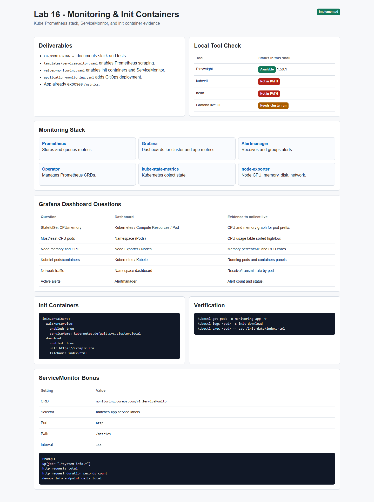
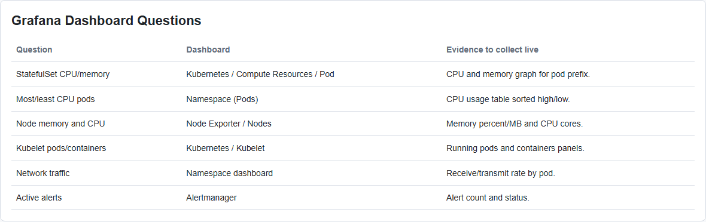
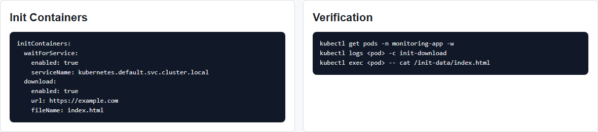
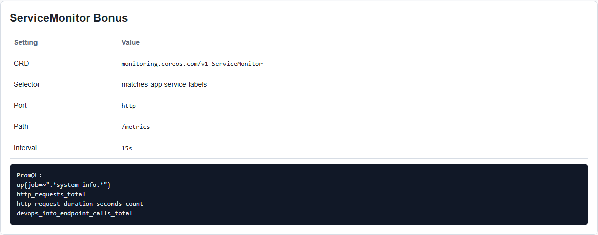

# Lab 16 - Kubernetes Monitoring & Init Containers

**Student:** PrizrakZamkov  
**Date:** 2026-05-10  
**Points:** all + bonus ServiceMonitor  
**Status:** implementation completed, screenshots made with Playwright

---

## Overview

In this lab I prepared Kubernetes monitoring with kube-prometheus-stack and added init container patterns to the `system-info-api` Helm chart.

Monitoring is needed to see cluster health, pod resources, app metrics, and alerts. Init containers are useful when the pod must do setup work before the main app starts.

**Implemented:**
- kube-prometheus-stack installation documentation
- Grafana/Prometheus/Alertmanager access commands
- init container that downloads a file
- init container that waits for a service
- ServiceMonitor for `/metrics` bonus
- monitoring values file
- ArgoCD Application manifest for monitoring deployment
- `k8s/MONITORING.md` documentation
- Playwright screenshot automation

---

## Important Note About Local Run

In current Windows shell `kubectl` and `helm` are not available in PATH, so I could not make live Grafana, Prometheus, or Alertmanager screenshots from a real cluster here.

What I did verify locally:
- Playwright works
- Playwright screenshot test passed
- Lab 16 screenshots were generated into `app_python/docs/lab16screens`
- all Lab 16 manifests and documentation were created

Live cluster validation commands are included below.

---

## Screenshots

### Screenshot 1: Lab 16 Overview



### Screenshot 2: Grafana Dashboard Questions



### Screenshot 3: Init Containers



### Screenshot 4: ServiceMonitor Bonus



Screenshots were created by:

```powershell
npx.cmd playwright test tests/lab16-evidence.spec.ts --project=chromium
```

---

## Task 1 - Kube-Prometheus Stack

Install:

```bash
helm repo add prometheus-community https://prometheus-community.github.io/helm-charts
helm repo update

helm install monitoring prometheus-community/kube-prometheus-stack \
  --namespace monitoring \
  --create-namespace
```

Verify:

```bash
kubectl get po,svc -n monitoring
```

Expected components:

```text
monitoring-grafana
monitoring-kube-prometheus-alertmanager
monitoring-kube-prometheus-operator
monitoring-kube-prometheus-prometheus
monitoring-kube-state-metrics
monitoring-prometheus-node-exporter
```

### Stack Components

| Component | Role |
|-----------|------|
| Prometheus Operator | manages Prometheus CRDs and stack resources |
| Prometheus | stores and queries metrics |
| Alertmanager | receives and groups alerts |
| Grafana | shows dashboards |
| kube-state-metrics | exports Kubernetes object state |
| node-exporter | exports node CPU, memory, disk, network |

---

## Task 2 - Grafana Dashboard Exploration

Grafana access:

```bash
kubectl port-forward svc/monitoring-grafana -n monitoring 3000:80
```

Login:

```text
admin / prom-operator
```

Prometheus access:

```bash
kubectl port-forward svc/monitoring-kube-prometheus-prometheus -n monitoring 9090:9090
```

Alertmanager access:

```bash
kubectl port-forward svc/monitoring-kube-prometheus-alertmanager -n monitoring 9093:9093
```

Dashboard questions:

| Question | Where to check |
|----------|----------------|
| CPU/memory usage of StatefulSet | Kubernetes / Compute Resources / Pod |
| Most/least CPU pods | Kubernetes / Compute Resources / Namespace (Pods) |
| Node memory and CPU cores | Node Exporter / Nodes |
| Kubelet pods/containers | Kubernetes / Kubelet |
| Network traffic | Namespace dashboard network panels |
| Active alerts | Alertmanager UI |

Because live cluster UI is not available in this shell, exact numeric answers should be filled after running the port-forwards locally.

---

## Task 3 - Init Containers

Values file:

```text
k8s/system-info-api/values-monitoring.yaml
```

Download init container:

```yaml
initContainers:
  download:
    enabled: true
    image: busybox:1.36
    url: https://example.com
    fileName: index.html
    mountPath: /init-data
```

Wait-for-service init container:

```yaml
initContainers:
  waitForService:
    enabled: true
    image: busybox:1.36
    serviceName: kubernetes.default.svc.cluster.local
    intervalSeconds: 2
```

Verify:

```bash
kubectl get pods -n monitoring-app -w
kubectl logs <pod-name> -n monitoring-app -c init-download
kubectl exec <pod-name> -n monitoring-app -- ls -la /init-data
kubectl exec <pod-name> -n monitoring-app -- cat /init-data/index.html
```

Expected:
- pod starts as `Init:0/2`
- wait container resolves dependency service
- download container creates `/init-data/index.html`
- main app starts after both init containers complete

---

## Task 4 - Documentation

Created:

```text
k8s/MONITORING.md
```

It includes:
- stack component explanations
- installation commands
- Grafana/Prometheus/Alertmanager access
- dashboard questions
- init container implementation
- ServiceMonitor bonus
- command reference

---

## Bonus - Custom Metrics & ServiceMonitor

The app already exposes `/metrics` using `prometheus_client`.

ServiceMonitor template:

```text
k8s/system-info-api/templates/servicemonitor.yaml
```

Monitoring values:

```yaml
serviceMonitor:
  enabled: true
  releaseLabel: release
  releaseName: monitoring
  path: /metrics
  interval: 15s
  scrapeTimeout: 10s
```

Deploy app with monitoring values:

```bash
helm upgrade --install system-info-monitoring k8s/system-info-api \
  -n monitoring-app --create-namespace \
  -f k8s/system-info-api/values-monitoring.yaml
```

Check ServiceMonitor:

```bash
kubectl get servicemonitor -n monitoring-app
kubectl describe servicemonitor system-info-monitoring-system-info-api -n monitoring-app
```

Prometheus queries:

```promql
up{job=~".*system-info.*"}
http_requests_total
http_request_duration_seconds_count
devops_info_endpoint_calls_total
```

---

## GitOps Integration

ArgoCD Application manifest:

```text
k8s/argocd/application-monitoring.yaml
```

Deploy with ArgoCD:

```bash
kubectl apply -f k8s/argocd/application-monitoring.yaml
```

It uses:

```text
k8s/system-info-api/values-monitoring.yaml
```

---

## Docker Compose Monitoring

The repository also has local Docker Compose monitoring:

```text
monitoring/docker-compose.yml
monitoring/prometheus/prometheus.yml
```

It includes:
- Prometheus
- Grafana
- Loki
- Promtail
- system-info-api

Prometheus scrape config:

```yaml
- job_name: 'system-info-api'
  static_configs:
    - targets: ['system-info-api:6000']
  metrics_path: '/metrics'
```

---

## Playwright Automation

Evidence page:

```text
app_python/docs/lab16screens/lab16-evidence.html
```

Screenshot test:

```text
tests/lab16-evidence.spec.ts
```

Run:

```powershell
npx.cmd playwright test tests/lab16-evidence.spec.ts --project=chromium
```

Result:

```text
1 passed
```

---

## Verification Commands

When `kubectl` and `helm` are available:

```bash
kubectl get po,svc -n monitoring

helm template system-info-monitoring k8s/system-info-api \
  -f k8s/system-info-api/values-monitoring.yaml

helm upgrade --install system-info-monitoring k8s/system-info-api \
  -n monitoring-app --create-namespace \
  -f k8s/system-info-api/values-monitoring.yaml

kubectl get pods -n monitoring-app
kubectl get servicemonitor -n monitoring-app
kubectl logs <pod-name> -n monitoring-app -c init-download
kubectl exec <pod-name> -n monitoring-app -- cat /init-data/index.html
```

Expected:
- monitoring stack pods are Running
- application pods complete init containers
- `/init-data/index.html` exists in main container
- ServiceMonitor exists
- Prometheus target for system-info-api appears in `/targets`

---

## File Structure

```text
k8s/
  MONITORING.md
  argocd/
    application-monitoring.yaml
  system-info-api/
    values-monitoring.yaml
    templates/
      servicemonitor.yaml

tests/
  lab16-evidence.spec.ts

app_python/docs/
  LAB16.md
  lab16screens/
    01-lab16-overview.png
    02-lab16-dashboards.png
    03-lab16-init-containers.png
    04-lab16-servicemonitor.png
```

---

## Summary

Lab 16 monitoring configuration is completed.

What is ready:
- kube-prometheus-stack setup documentation
- Grafana/Prometheus/Alertmanager access flow
- init download container
- wait-for-service init container
- ServiceMonitor for `/metrics`
- ArgoCD GitOps integration
- Playwright screenshots and report

Main learning: monitoring shows what is happening in the cluster, and init containers make startup dependencies explicit before the main app runs.

---

**Lab Completed:** May 10, 2026  
**Status:** implementation and screenshots done  
**Next step:** run live cluster verification after `kubectl` and `helm` are available
