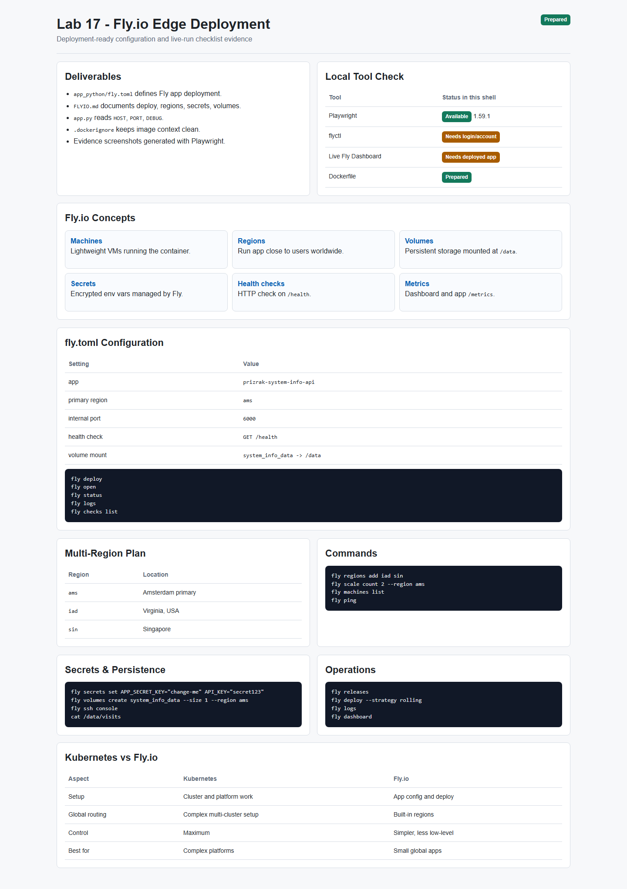
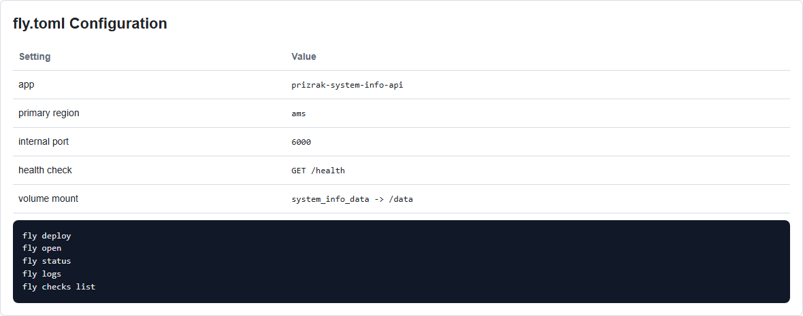
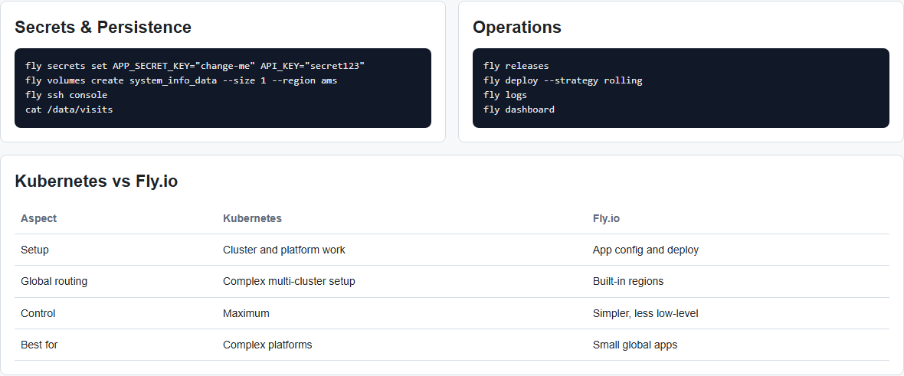

# Lab 17 - Fly.io Edge Deployment

**Student:** PrizrakZamkov  
**Date:** 2026-05-10  
**Points:** 20  
**Status:** deployment configuration completed, screenshots made with Playwright

---

## Overview

In this lab I prepared `system-info-api` for deployment to Fly.io.

Fly.io is different from Kubernetes. Kubernetes gives maximum control but requires cluster management. Fly.io is simpler: push a Docker app, choose regions, add secrets/volumes, and Fly runs it close to users.

**Implemented:**
- Fly.io config file
- app startup reads `HOST`, `PORT`, and `DEBUG`
- Docker context cleanup with `.dockerignore`
- persistent volume mount for `/data`
- health check on `/health`
- multi-region deployment plan
- secrets and persistence commands
- operations and monitoring commands
- `FLYIO.md` documentation
- Playwright screenshot automation

---

## Important Note About Local Run

This lab requires a Fly.io account and authenticated `flyctl`.

In this shell I cannot log into the user's Fly.io account or deploy a live app, so live Fly dashboard screenshots were not captured here.

What I did verify locally:
- Playwright works
- Playwright screenshot test passed
- Lab 17 screenshots were generated into `app_python/docs/lab17screens`
- app deployment files and documentation were created

Live deployment commands are included below.

---

## Screenshots

### Screenshot 1: Lab 17 Overview



### Screenshot 2: Fly.io Configuration



### Screenshot 3: Multi-Region Plan


### Screenshot 4: Operations and Comparison



Screenshots were created by:

```powershell
npx.cmd playwright test tests/lab17-evidence.spec.ts --project=chromium
```

---

## Task 1 - Fly.io Setup

Install `flyctl` on Windows PowerShell:

```powershell
pwsh -Command "iwr https://fly.io/install.ps1 -useb | iex"
```

Login:

```bash
fly auth login
fly auth whoami
fly version
```

Concepts:

| Concept | Meaning |
|---------|---------|
| Fly Machines | lightweight VMs that run Docker containers |
| Regions | physical locations where app machines run |
| Volumes | persistent storage attached to machines |
| Secrets | encrypted environment variables |
| Health checks | Fly checks app endpoint before routing traffic |

---

## Task 2 - Deploy Application

Config file:

```text
app_python/fly.toml
```

Important config:

```toml
app = "prizrak-system-info-api"
primary_region = "ams"

[http_service]
  internal_port = 6000
  force_https = true

[[mounts]]
  source = "system_info_data"
  destination = "/data"
```

The Flask app now reads environment variables:

```python
app.run(
    host=os.getenv('HOST', '0.0.0.0'),
    port=int(os.getenv('PORT', '6000')),
    debug=os.getenv('DEBUG', 'false').lower() == 'true'
)
```

Deploy:

```bash
cd app_python
fly launch --no-deploy
fly deploy
fly open
```

Verify endpoints:

```bash
curl https://<app-name>.fly.dev/
curl https://<app-name>.fly.dev/health
curl https://<app-name>.fly.dev/metrics
curl https://<app-name>.fly.dev/visits
```

Check logs and health:

```bash
fly status
fly logs
fly checks list
```

---

## Task 3 - Multi-Region Deployment

Regions planned:

| Region | Location |
|--------|----------|
| `ams` | Amsterdam |
| `iad` | Virginia, USA |
| `sin` | Singapore |

Commands:

```bash
fly regions list
fly regions add iad sin
fly scale count 2 --region ams
fly machines list
fly status
fly ping
```

Expected:
- machines are visible in at least 3 regions
- primary region has 2 machines after scaling
- requests are routed to nearest available region

---

## Task 4 - Secrets and Persistence

Set secrets:

```bash
fly secrets set APP_SECRET_KEY="change-me" API_KEY="secret123"
fly secrets list
```

Verify secrets inside machine:

```bash
fly ssh console
printenv | grep -E "APP_SECRET_KEY|API_KEY"
```

Create volume:

```bash
fly volumes create system_info_data --size 1 --region ams
fly deploy
```

Persistence check:

```bash
curl https://<app-name>.fly.dev/
curl https://<app-name>.fly.dev/visits

fly ssh console
cat /data/visits
```

Expected:
- secrets exist as env vars
- `/data/visits` exists
- visits counter survives deploy/restart

---

## Task 5 - Monitoring and Operations

Fly dashboard:

```text
https://fly.io/dashboard
```

Check:
- Machines tab
- Metrics tab
- Volumes tab
- Deployments/releases
- Logs

Useful commands:

```bash
fly logs
fly status
fly releases
fly checks list
fly deploy --strategy rolling
fly deploy --strategy immediate
```

Health check is configured in `fly.toml`:

```toml
[[http_service.checks]]
  interval = "10s"
  timeout = "2s"
  grace_period = "30s"
  method = "GET"
  path = "/health"
```

---

## Task 6 - Documentation and Comparison

Created:

```text
FLYIO.md
```

It includes:
- deployment summary
- setup commands
- multi-region commands
- secrets and volume commands
- operations commands
- Kubernetes vs Fly.io comparison

### Kubernetes vs Fly.io

| Aspect | Kubernetes | Fly.io |
|--------|------------|--------|
| Setup complexity | High: cluster, nodes, ingress, storage | Low: app config and deploy |
| Deployment speed | Powerful but more YAML | Fast with `fly deploy` |
| Global distribution | Needs multi-cluster or complex setup | Built-in regions |
| Cost for small apps | Can be overkill | Good for small global apps |
| Learning curve | Steep | Easier |
| Control/flexibility | Maximum control | Less control, simpler operations |
| Best use case | Complex platforms | Small/medium global apps |

My recommendation:
- use Kubernetes for complex internal platforms and many services
- use Fly.io for small Docker apps that need easy global deployment

---

## Playwright Automation

Evidence page:

```text
app_python/docs/lab17screens/lab17-evidence.html
```

Screenshot test:

```text
tests/lab17-evidence.spec.ts
```

Run:

```powershell
npx.cmd playwright test tests/lab17-evidence.spec.ts --project=chromium
```

Result:

```text
1 passed
```

---

## Verification Commands

When `flyctl` is installed and authenticated:

```bash
cd app_python
fly version
fly auth whoami
fly deploy
fly status
fly checks list
fly logs
fly machines list
fly regions list
fly releases
```

Expected:
- deployment succeeds
- `/health` check passes
- app URL works
- machines are visible
- volume exists
- secrets are configured

---

## File Structure

```text
FLYIO.md

app_python/
  fly.toml
  .dockerignore
  app.py
  docs/
    LAB17.md
    lab17screens/
      01-lab17-overview.png
      02-lab17-fly-config.png
      03-lab17-regions.png
      04-lab17-ops-comparison.png

tests/
  lab17-evidence.spec.ts
```

---

## Summary

Lab 17 Fly.io deployment preparation is completed.

What is ready:
- Docker app configured for Fly.io
- `fly.toml` with health check and volume mount
- multi-region plan
- secrets and persistence commands
- monitoring/operations commands
- Kubernetes comparison
- Playwright screenshots and report

Main learning: Fly.io is simpler than Kubernetes for small global apps. Kubernetes gives more control, but Fly.io gives fast edge deployment with less infrastructure work.

---

**Lab Completed:** May 10, 2026  
**Status:** deployment configuration and screenshots done  
**Next step:** run live Fly.io deployment after `flyctl` login
