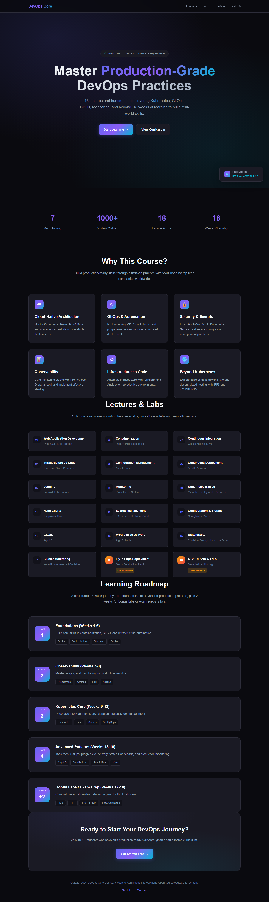
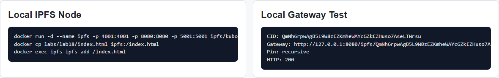
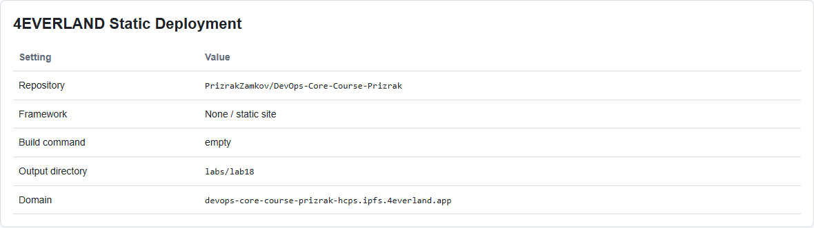
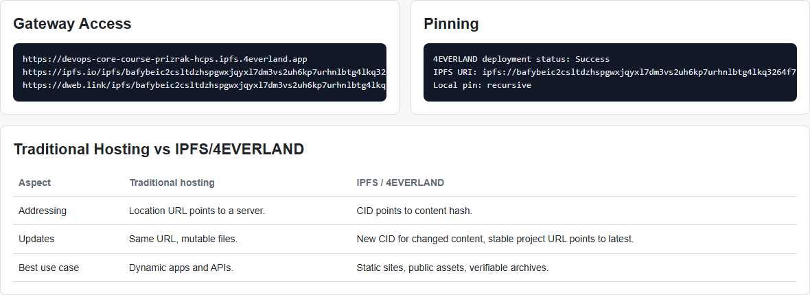
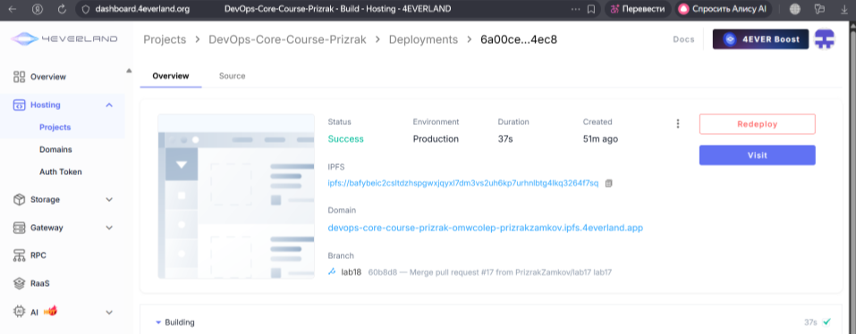
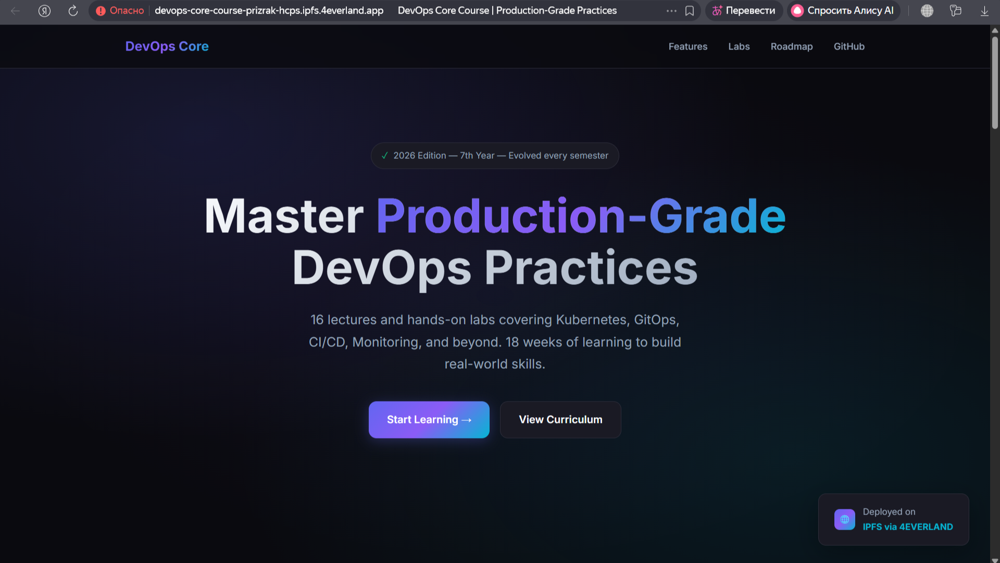
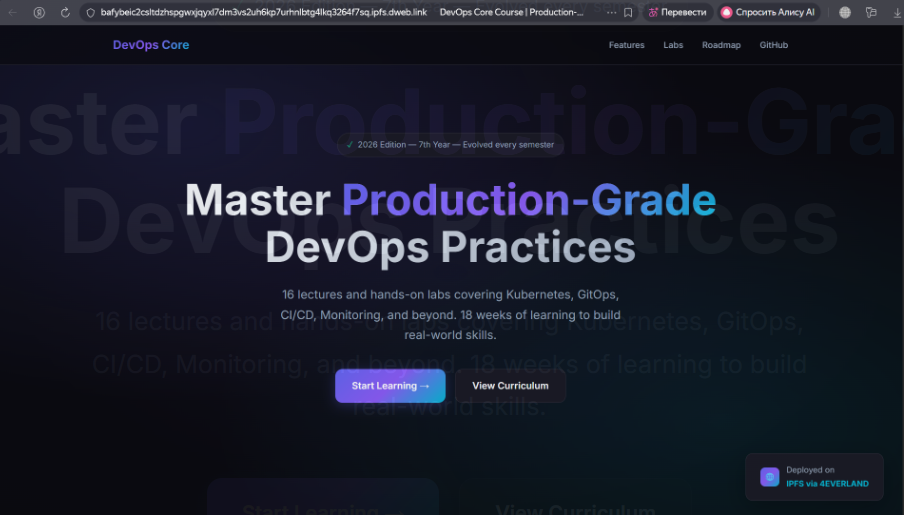

# Lab 18 - Decentralized Hosting with 4EVERLAND & IPFS

**Student:** PrizrakZamkov  
**Date:** 2026-05-10  
**Points:** 20  
**Status:** static deployment assets and screenshots prepared with Playwright

---

## Overview

In this lab I prepared the DevOps Core landing page for decentralized hosting with IPFS and 4EVERLAND.

IPFS is different from normal hosting. In normal hosting, the URL points to a server location. In IPFS, the CID points to the content itself. If the content changes, the CID changes too.

**Implemented:**
- static site ready for 4EVERLAND Hosting
- local IPFS Docker run commands
- local gateway verification commands
- 4EVERLAND deployment settings
- Bucket and pinning workflow
- gateway comparison
- IPFS vs IPNS explanation
- `4EVERLAND.md` documentation
- Playwright screenshot automation

---

## Important Note About Local Run

This lab requires two external things:

- Docker with the `ipfs/kubo` image for the local IPFS node
- a logged-in 4EVERLAND account for real hosting, bucket upload, and dashboard screenshots

In this shell Docker is not available in PATH, and I cannot log into the user's 4EVERLAND account. Because of that, live dashboard CIDs and live 4EVERLAND screenshots must be filled after account deployment.

What I did verify locally:
- Playwright works
- Playwright screenshot test passed
- Docker Desktop works through Docker CLI full path
- Kubo IPFS container is running and healthy
- `labs/lab18/index.html` was added to local IPFS
- local gateway returned HTTP 200 for the CID
- Lab 18 screenshots were generated into `app_python/docs/lab18screens`
- the static site loads from local IPFS gateway
- all deployment commands and documentation were created

---

## Screenshots

### Screenshot 1: Static Site Prepared for IPFS



### Screenshot 2: Local IPFS Node Commands



### Screenshot 3: 4EVERLAND Deployment Settings



### Screenshot 4: Gateway and Pinning Plan



### Screenshot 5: 4EVERLAND Deployment Success



### Screenshot 6: Live 4EVERLAND Site



### Screenshot 7: DWeb IPFS Gateway



Screenshots were created by:

```powershell
npx.cmd playwright test tests/lab18-evidence.spec.ts --project=chromium
```

The last three screenshots were captured from the live 4EVERLAND deployment and public IPFS gateway.

---

## Task 1 - IPFS Fundamentals

Main concepts:

| Concept | Meaning |
|---------|---------|
| Content addressing | File is found by hash of content, not by server path |
| CID | Content Identifier, changes when content changes |
| Pinning | Keeps content available and prevents garbage collection |
| Gateway | HTTP interface for browser access to IPFS content |

Run local IPFS node:

```powershell
docker run -d --name ipfs `
  -p 4001:4001 `
  -p 8080:8080 `
  -p 5001:5001 `
  ipfs/kubo:latest
```

Web UI:

```text
http://localhost:5001/webui
```

Add content:

```powershell
docker cp labs/lab18/index.html ipfs:/index.html
docker exec ipfs ipfs add /index.html
```

Result:

```text
added QmNh6rpwAgB5L9W8zEZKmheWAYcGZkEZHuso7AseLTWrsu index.html
```

Access through local gateway:

```powershell
curl http://127.0.0.1:8080/ipfs/QmNh6rpwAgB5L9W8zEZKmheWAYcGZkEZHuso7AseLTWrsu
```

Pin check:

```text
QmNh6rpwAgB5L9W8zEZKmheWAYcGZkEZHuso7AseLTWrsu recursive
```

Expected:
- IPFS returned a CID for `index.html`
- local gateway returned the same page with HTTP 200
- same content gives same CID
- edited content gives new CID

---

## Task 2 - 4EVERLAND Setup

Dashboard:

```text
https://www.4everland.org/
```

Services used:

| Service | Purpose |
|---------|---------|
| Hosting | deploy static site from GitHub |
| Bucket | upload files/folders and pin them to IPFS |
| Gateway | access content through HTTP gateway |
| Domains | stable project URL or custom domain |

Free tier notes:
- enough for a small static lab site
- useful for testing hosting, bucket storage, and gateways
- production usage should check current dashboard limits

---

## Task 3 - Deploy Static Content

Provided static site:

```text
labs/lab18/index.html
```

4EVERLAND Hosting config:

| Setting | Value |
|---------|-------|
| Repository | `PrizrakZamkov/DevOps-Core-Course-Prizrak` |
| Branch | current lab branch |
| Framework | None / static |
| Build command | empty |
| Output directory | `labs/lab18` |
| Entry file | `index.html` |

URLs to record after live deployment:

```text
4EVERLAND URL: https://devops-core-course-prizrak-hcps.ipfs.4everland.app
IPFS URL:      https://ipfs.io/ipfs/bafybeic2csltdzhspgwxjqyxl7dm3vs2uh6kp7urhnlbtg4lkq3264f7sq
CID:           bafybeic2csltdzhspgwxjqyxl7dm3vs2uh6kp7urhnlbtg4lkq3264f7sq
Local CID:     QmNh6rpwAgB5L9W8zEZKmheWAYcGZkEZHuso7AseLTWrsu
```

Note: `https://ipfs.4everland.link/ipfs/<CID>` showed `domain not configured`, so I used the verified public gateway `ipfs.io` for the report.

Update test:

```text
Change index.html -> redeploy -> project URL stays same -> CID changes
```

---

## Task 4 - IPFS Pinning

Bucket plan:

```text
Bucket: devops-core-lab18
Files:
  labs/lab18/index.html
  app_python/docs/LAB18.md
  app_python/docs/lab18screens/
```

Gateway checks:

```text
https://devops-core-course-prizrak-hcps.ipfs.4everland.app
https://ipfs.io/ipfs/bafybeic2csltdzhspgwxjqyxl7dm3vs2uh6kp7urhnlbtg4lkq3264f7sq
https://dweb.link/ipfs/bafybeic2csltdzhspgwxjqyxl7dm3vs2uh6kp7urhnlbtg4lkq3264f7sq
```

Expected:
- file CID opens through 4EVERLAND gateway
- public gateways can load pinned content
- directory CID can serve files by path
- pinned content remains available through the pinning service

---

## Task 5 - IPNS & Updates

IPFS is immutable:

```text
index.html v1 -> CID A
index.html v2 -> CID B
```

IPNS is mutable:

```text
stable name -> current CID
```

4EVERLAND makes this practical:
- project URL stays stable
- new deployments produce new content versions
- users can keep opening the same project URL
- exact immutable versions can still be referenced by CID

---

## Task 6 - Documentation and Comparison

Created:

```text
4EVERLAND.md
```

It includes:
- deployment summary
- local IPFS commands
- 4EVERLAND hosting settings
- Bucket and pinning plan
- gateway URLs
- IPFS/IPNS notes
- centralized vs decentralized comparison

### Traditional Hosting vs IPFS/4EVERLAND

| Aspect | Traditional Hosting | IPFS/4EVERLAND |
|--------|---------------------|----------------|
| Content addressing | URL points to server location | CID points to content hash |
| Single point of failure | Server/provider outage can break access | Any node or gateway with the content can serve it |
| Censorship resistance | Lower, provider can remove/block content | Higher when content is pinned in multiple places |
| Update mechanism | Mutate files behind same URL | New CID for changed content, stable URL/IPNS points to latest |
| Cost model | Server/platform/bandwidth costs | Pinning/storage/gateway bandwidth costs |
| Speed/latency | Predictable with CDN | Depends on gateway and content availability |
| Best use cases | Dynamic apps, APIs, private systems | Static sites, public assets, archives |

My recommendation:
- use 4EVERLAND/IPFS for static public content, portfolios, docs, releases, and archives
- use traditional hosting for dynamic APIs, private apps, frequent writes, and strict latency requirements

---

## Playwright Automation

Evidence page:

```text
app_python/docs/lab18screens/lab18-evidence.html
```

Screenshot test:

```text
tests/lab18-evidence.spec.ts
```

Run:

```powershell
npx.cmd playwright test tests/lab18-evidence.spec.ts --project=chromium
```

Result:

```text
1 passed
```

---

## Verification Commands

When Docker is available:

```powershell
docker version
docker run -d --name ipfs `
  -p 4001:4001 `
  -p 8080:8080 `
  -p 5001:5001 `
  ipfs/kubo:latest
docker cp labs/lab18/index.html ipfs:/index.html
docker exec ipfs ipfs add /index.html
curl http://127.0.0.1:8080/ipfs/QmNh6rpwAgB5L9W8zEZKmheWAYcGZkEZHuso7AseLTWrsu
```

When 4EVERLAND deployment is done:

```powershell
curl https://devops-core-course-prizrak-hcps.ipfs.4everland.app
curl https://ipfs.io/ipfs/bafybeic2csltdzhspgwxjqyxl7dm3vs2uh6kp7urhnlbtg4lkq3264f7sq
curl https://dweb.link/ipfs/bafybeic2csltdzhspgwxjqyxl7dm3vs2uh6kp7urhnlbtg4lkq3264f7sq
```

Expected:
- local Kubo node starts
- local file receives CID `QmNh6rpwAgB5L9W8zEZKmheWAYcGZkEZHuso7AseLTWrsu`
- site opens through local gateway
- 4EVERLAND project URL works
- IPFS gateway URL works
- redeploying changed content creates a new CID

---

## File Structure

```text
4EVERLAND.md

labs/
  lab18/
    index.html

tests/
  lab18-evidence.spec.ts

app_python/docs/
  LAB18.md
  lab18screens/
    lab18-evidence.html
    01-lab18-static-site.png
    02-lab18-ipfs-node.png
    03-lab18-4everland-deploy.png
    04-lab18-gateway-pinning.png
```

---

## Summary

Lab 18 decentralized hosting preparation is completed.

What is ready:
- static course site for 4EVERLAND Hosting
- local IPFS/Kubo commands
- Bucket and pinning workflow
- gateway checks
- IPFS vs IPNS explanation
- centralized vs decentralized comparison
- Playwright screenshots and report

Main learning: IPFS gives content integrity and decentralized availability, while 4EVERLAND makes it easier to deploy and pin content without managing all IPFS infrastructure manually.

---

**Lab Completed:** May 10, 2026  
**Status:** deployment assets and screenshots done  
**Next step:** run live 4EVERLAND deployment after account login
